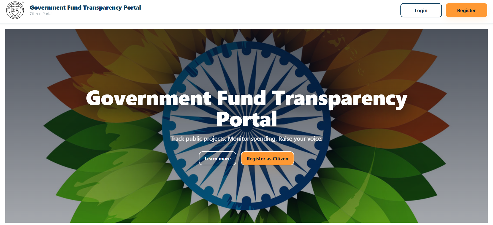
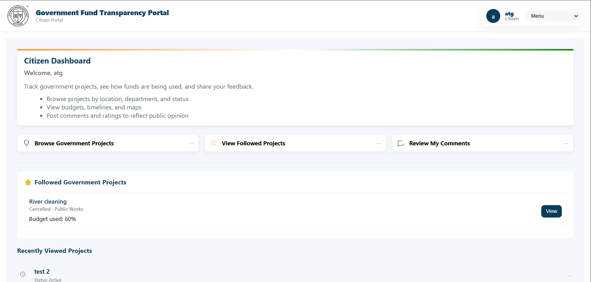
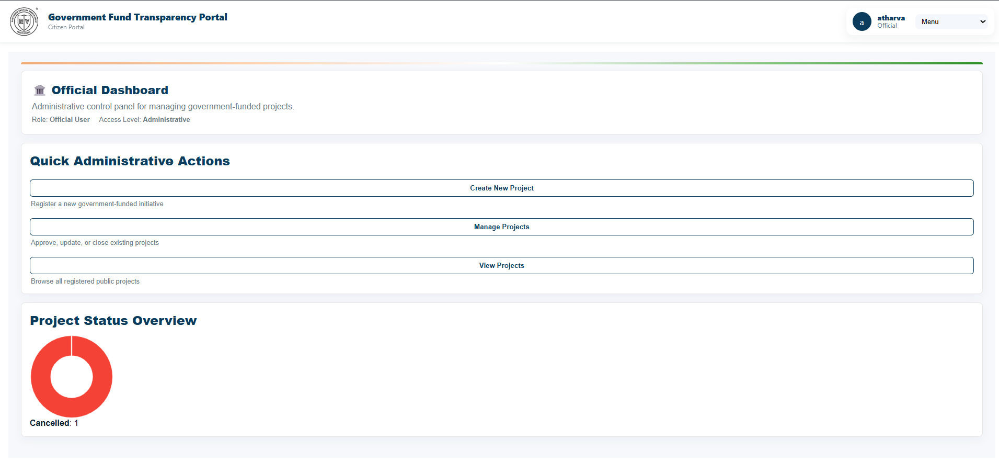

# Government Project Fund Monitoring System

A role-based web application for transparent monitoring of government project funds in India. This system enables citizens to view project details and provide feedback, allows officials to manage projects and fund allocations, and provides administrators with comprehensive oversight and audit capabilities.

## Table of Contents

- [Features](#features)
- [Tech Stack](#tech-stack)
- [Project Structure](#project-structure)
- [Getting Started](#getting-started)
  - [Prerequisites](#prerequisites)
  - [Installation](#installation)
  - [Environment Setup](#environment-setup)
  - [Database Setup](#database-setup)
  - [Running the Application](#running-the-application)
- [Usage](#usage)
- [API Overview](#api-overview)
- [Database Schema](#database-schema)
- [Support & Documentation](#support--documentation)

## Features

### Core Functionality

- **Role-Based Access Control**: Three distinct user roles (Citizen, Official, Admin) with tailored dashboards and permissions
- **Project Management**: Create, update, and manage government infrastructure projects with detailed budget tracking
- **Real-Time Fund Tracking**: Monitor total, allocated, and remaining project funds with immutable transaction audit logs
- **Progress Timeline**: Officials can post textual updates and status changes; citizens see chronological project progress
- **Citizen Feedback System**: Collect ratings and comments on projects with automatic sentiment analysis
- **Interactive Map**: Visualize project locations across India with geospatial filters
- **Sentiment Analysis**: Automatically analyze citizen feedback to generate project sentiment summaries
- **Biometric Authentication**: biometric enrollment and verification  for admin and official for enhanced security
- **Project Gallery**: Upload and manage project photos and documentation
- **Audit Logging**: Complete immutable audit trail for compliance and transparency
- **Admin Controls**: Manage users, flag/delete projects, and monitor system activity

### Data Integrity

- Foreign key constraints on all relationships
- Role-based authorization enforcement
- Input validation using Joi schema validation
- JWT-based token authentication with refresh token support
- Comprehensive error handling and meaningful error messages

## Tech Stack

### Backend
- **Runtime**: Node.js
- **Framework**: Express.js
- **Validation**: Joi
- **Authentication**: JWT (JSON Web Tokens)
- **Security**: bcrypt (password hashing)
- **File Upload**: Multer
- **Testing**: Jest, Supertest

### Databases
- **Relational**: MySQL 8.x (projects, users, transactions, updates, comments, audit logs)
- **Document Store**: MongoDB (raw feedback for sentiment analysis)

### Frontend
- **Framework**: React 18.2
- **Build Tool**: Vite
- **HTTP Client**: Axios
- **Maps**: Leaflet
- **Charts**: Chart.js with React integration
- **Routing**: React Router v6

### Deployment & DevOps
- Environment configuration via dotenv
- CORS support for cross-origin requests
- Static file serving for gallery uploads
- Database migrations and seeding scripts

## Project Structure

```
├── backend/                    # Node.js Express backend API
│   ├── src/
│   │   ├── index.js           # Express app entry point
│   │   ├── config.js          # Configuration management
│   │   ├── db_mysql.js        # MySQL connection
│   │   ├── db_mongo.js        # MongoDB connection
│   │   ├── routes/            # API route handlers
│   │   │   ├── auth.js        # Authentication endpoints
│   │   │   ├── projects.js    # Project CRUD endpoints
│   │   │   ├── admin.js       # Admin-only endpoints
│   │   │   ├── insights.js    # Analytics endpoints
│   │   │   ├── biometric.js   # Biometric endpoints
│   │   │   ├── gallery.js     # Project gallery endpoints
│   │   │   └── projectRequests.js  # Project request endpoints
│   │   ├── middleware/        # Express middleware
│   │   │   ├── auth.js        # JWT verification
│   │   │   ├── validate.js    # Joi validation
│   │   │   └── errorHandler.js # Error handling
│   │   ├── services/          # Business logic
│   │   │   ├── tokenService.js
│   │   │   ├── biometricService.js
│   │   │   ├── complianceEngine.js
│   │   │   └── riskEvaluator.js
│   │   ├── policy/            # Authorization policies
│   │   ├── security/          # Security utilities
│   │   └── insights/          # Analytics computation
│   ├── migrations/            # Database migrations
│   ├── seeds/                 # Database seed data
│   ├── worker/                # Background workers
│   └── test/                  # Test suites
├── frontend/                  # React frontend application
│   ├── src/
│   │   ├── main.jsx          # Application entry point
│   │   ├── App.jsx           # Root component
│   │   ├── components/       # Reusable components
│   │   ├── pages/            # Page components
│   │   ├── layouts/          # Layout components
│   │   ├── styles/           # Global styles
│   │   └── utils/            # Utility functions
│   └── vite.config.mjs       # Vite configuration
└── doc/                       # Documentation
    └── image/                # Screenshot and demo images
```

## Getting Started

### Prerequisites

- **Node.js**: v14 or higher (v16+ recommended)
- **npm**: v6 or higher
- **MySQL**: v8.0 or higher
- **MongoDB**: v4.4 or higher
- **Git**: For version control

### Installation

1. Clone the repository:
```bash
git clone https://github.com/AthSri0507/Govt-Fund-Transparency-Portal
cd dbms
```

2. Install backend dependencies:
```bash
cd backend
npm install
```

3. Install frontend dependencies:
```bash
cd ../frontend
npm install
```

### Environment Setup

Create a `.env` file in the `backend` directory with the following variables:

```env
# Server
PORT=4000

# MySQL Configuration
MYSQL_HOST=localhost
MYSQL_PORT=3306
MYSQL_USER=gov_user
MYSQL_PASSWORD=your_password_here
MYSQL_DATABASE=gov_projects_app

# MongoDB Configuration
MONGODB_URI=mongodb://localhost:27017/gov_feedback_app

# JWT Configuration
JWT_SECRET=your_super_secret_key_min_32_chars
JWT_ACCESS_EXPIRES=15m
JWT_REFRESH_EXPIRES=7d
```

Create a `.env` file in the `frontend` directory:

```env
VITE_API_BASE_URL=http://localhost:4000/api
```

### Database Setup

1. Start MySQL and MongoDB services:

```bash
# MySQL (Windows)
mysql -u root -p

# MongoDB (in a separate terminal)
mongod
```

2. Run database migrations:

```bash
cd backend
npm run migrate
```

3. (Optional) Seed initial data:

```bash
npm run seed
```

This creates:
- Default user accounts with different roles (Citizen, Official, Admin)
- Sample government projects
- Initial fund allocations

### Running the Application

#### Development Mode

Terminal 1 - Start the backend:
```bash
cd backend
npm run dev
```
The API will be available at `http://localhost:4000`

Terminal 2 - Start the frontend:
```bash
cd frontend
npm run dev
```
The application will be available at `http://localhost:5173`

#### Production Build

```bash
# Backend (runs from src/index.js directly)
cd backend
npm start

# Frontend build
cd frontend
npm run build
npm run preview
```

## Usage

### User Roles and Access

**Citizen Dashboard**
- View all public projects on the map and in list view
- Filter projects by location, department, and status
- View project details, budget information, and progress updates
- Post comments and star ratings and Images
- View sentiment analysis of project feedback

**Official Dashboard**
- Create and manage assigned projects
- Request other official for project detail through collabration framework
- Update project status and maintain progress timeline
- Record fund usage with purpose and amount
- View real-time fund utilization reports
- Monitor citizen feedback and sentiment trends

**Admin Dashboard**
- Manage all users and assign roles
- View complete audit logs of system activity
- Flag or delete problematic projects
- Monitor system health and usage metrics

### API Usage Examples

#### Authentication
```bash
# Login
curl -X POST http://localhost:4000/api/auth/login \
  -H "Content-Type: application/json" \
  -d '{
    "email": "citizen@example.com",
    "password": "password123"
  }'

# Response includes access_token and refresh_token
```

#### View Projects
```bash
curl -X GET http://localhost:4000/api/projects \
  -H "Authorization: Bearer YOUR_ACCESS_TOKEN"
```

#### Submit Feedback
```bash
curl -X POST http://localhost:4000/api/projects/1/comments \
  -H "Authorization: Bearer YOUR_ACCESS_TOKEN" \
  -H "Content-Type: application/json" \
  -d '{
    "rating": 4,
    "text": "Good progress on the project"
  }'
```

#### Record Fund Usage (Official)
```bash
curl -X POST http://localhost:4000/api/projects/1/fund-transaction \
  -H "Authorization: Bearer YOUR_ACCESS_TOKEN" \
  -H "Content-Type: application/json" \
  -d '{
    "amount": 50000,
    "purpose": "Materials and labor"
  }'
```

## API Overview

The API follows RESTful conventions. Base URL: `/api`

### Authentication Routes (`/auth`)
- `POST /login` - User login
- `POST /refresh` - Refresh access token
- `POST /logout` - User logout
- `POST /enroll-biometric` - Enroll biometric data
- `POST /verify-biometric` - Verify biometric identity

### Projects Routes (`/projects`)
- `GET /` - List all projects (paginated)
- `GET /:id` - Get project details
- `POST /` - Create project (Officials only)
- `PUT /:id` - Update project (Officials only)
- `POST /:id/updates` - Add progress update (Officials only)
- `POST /:id/comments` - Add comment/feedback (Citizens)
- `POST /:id/fund-transaction` - Record fund usage (Officials only)

### Admin Routes (`/admin`)
- `GET /audit-logs` - View activity audit logs
- `GET /users` - Manage users
- `DELETE /projects/:id` - Delete project
- `PUT /projects/:id/flag` - Flag project

### Insights Routes (`/insights`)
- `GET /projects/:id/sentiment` - Get sentiment analysis
- `GET /dashboard` - Get analytics dashboard

For complete API documentation, see the API Overview section above.

## Database Schema

### Core Tables

**users**
- Stores user accounts with roles (Citizen, Official, Admin)
- Includes authentication credentials and profile information

**projects**
- Government infrastructure projects with budget allocation
- Tracks status, location (latitude/longitude), and timeline
- Maintains total and used budget amounts

**fund_transaction**
- Immutable log of all fund usage
- Links to projects and officials
- Includes purpose and date of transaction

**project_update**
- Timeline of status changes and progress reports by officials
- Chronologically displayed to citizens

**comments**
- Citizen feedback on projects with star ratings (1-5)
- Subject to sentiment analysis

**audit_log**
- Complete record of all administrative actions
- Tracks user actions, modified records, and timestamps

### MongoDB Collection

**raw_feedback**
- Stores raw citizen comments for sentiment analysis
- Used by background workers to generate sentiment summaries

All database migrations are automated through the `npm run migrate` command.


### Running Tests

```bash
# Backend tests
cd backend
npm test

# Backend tests with coverage
npm test -- --coverage

# Watch mode for development
npm test -- --watch
```

## Support & Documentation


### Troubleshooting

**Database Connection Issues**
- Verify MySQL and MongoDB are running
- Check credentials in `.env` file
- Ensure proper database and user creation

**Port Already in Use**
- Backend uses port 4000 (customizable via `PORT` env var)
- Frontend uses port 5173 (Vite default)
- Change ports in `package.json` scripts if needed

**Missing Environment Variables**
- Ensure `.env` file exists in `backend/` directory
- Check all required variables are set
- Restart development servers after updating `.env`

**CORS Issues**
- Verify frontend URL is listed in CORS configuration in [backend/src/index.js](backend/src/index.js)
- Check that `VITE_API_BASE_URL` matches backend URL in frontend `.env`

### Getting Help

For issues, questions, or suggestions:
1. Run tests with `npm test` to verify your setup
2. Open an issue with detailed description of the problem
3. Include relevant logs and environment information


---

## Screenshots & Demo

### Landing Page & Project Location Map
Interactive map displaying all government projects across India with geospatial filters.



### Citizen Dashboard
Citizens can browse projects, submit feedback, and view sentiment analysis of community responses.



### Official Dashboard
Officials manage project details, track fund utilization, and post progress updates.



### Admin Dashboard
Administrators manage users, review audit logs, and flag or delete problematic projects.


---

**Last Updated**: February 2026

